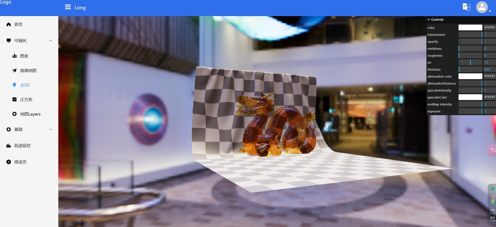
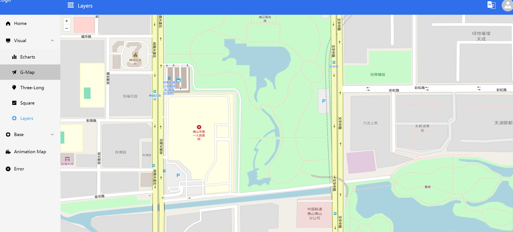
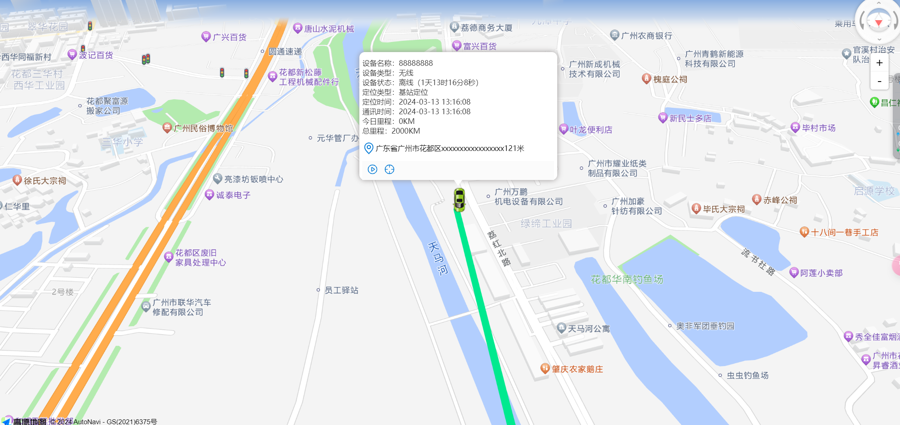
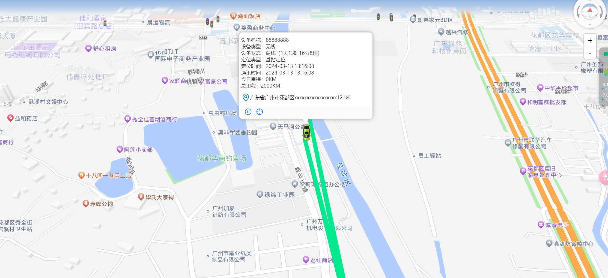

# 页面展示

包含md文档基础学习 ---> public/document.md

## ts快速入门

[ts快速入门](https://blog.csdn.net/weixin_56478633/article/details/136192196 "ts快速入门")

## svg地址

[svg地址](https://www.iconfont.cn/collections/detail?spm=a313x.search_index.0.da5a778a4.35073a81mNXxqb&cid=27861 "svg地址")
